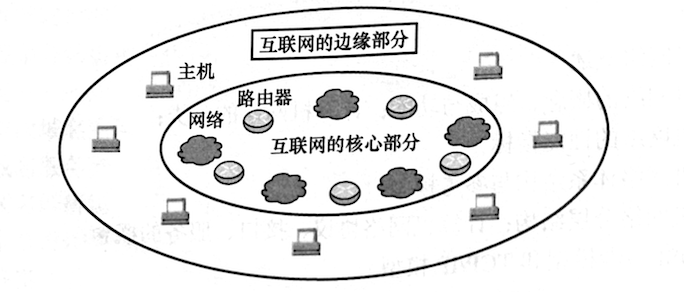
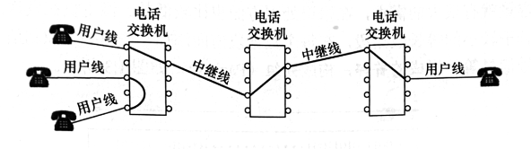
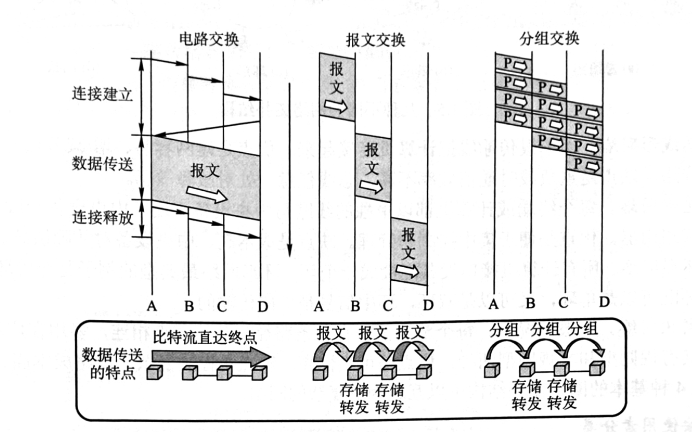
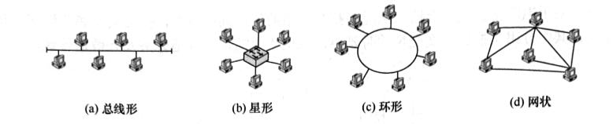
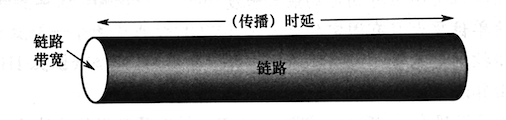

# 第一章 计算机网络导论


## 1.1 计算机网络概述

### 1.1.1 计算机网络的概念
一般认为，计算机网络是一个将众多分散的、自治的计算机系统，通过通信设备与线路连接起来，由功能完善的软件实现**资源共享和信息传递**的系统。

计算机网络（简称网络）由若干节点（Node，或译为结点）和连接这些节点的链路（Link）组成。**网络中的节点可以是计算机、集线器、交换机或路由器等。** 网络之间还可通过路由器互连，构成一个覆盖范围更广的计算机网络，这样的网络称为互连网（internet）。于是，我们可以这样理解：**网络把许多计算机连在一起，而互连网则把许多网络通过路由器连在一起。**


请读者注意以下两个意思相差很大的名词：interet 和 Internet。
+ internet（互连网）是一个通用名词，泛指由多个计算机网络互连而成的计算机网络。在这些网络之间可以使用任意的通信协议作为通信规则，不一定非要使用TCP/P。
+ Internet（互联网或因特网）则是一个专用名词，指当前全球最大的、开放的、由众多网络和路由器互连而成的特定计算机网络，它采用 TCP/IP 族作通信规则。


### 1.1.2 计算机网络的组成

从不同的角度看，可将计算机网络的组成分为如下几类。
+ 从组成部分看，计算机网络主要由硬件、软件、协议三大部分组成。**硬件**主要由主机（也称端系统）、通信链路（如双绞线、光纤）、交换设备（如路由器、交换机等）和通信处理机（如网卡）等组成。**软件**主要包括各种实现资源共享的软件和方便用户使用的各种工具软件（如E-mail 程序、FTP 程序、聊天程序等）。协议是计算机网络的核心，如同交通规则制约汽车驾驶一样，协议规定了网络传输数据时所避循的规范。
+ 从工作方式看，计算机网络（这里主要指Internet，即互联网）可分为**边缘部分**和**核心部分**。边缘部分由所有连接到互联网上的供用户直接使用的主机组成。用来进行通信（如传输数据、音频或视频）和资源共享：核心部分由大量网络和连接这些网络的路由器组成，它为边缘部分提供连通性和交换服务。给出了互联网核心部分与边缘部分的示意图。
+ 从功能组成看，计算机网络由通信子网和资源子网组成。**通信子网**由各种传输介质、通信设备和相应的网络协议组成，它使网络具有数据传输、交换、控制和存储的能力，实现联网计算机之间的数据通信。**资源子网**是实现资源共享功能的设备及其软件的集合，向网络用户提供共享其他计算机上的硬件资源、软件资源和数据资源的服务。




- 基础设施视角：
  - 数十亿互联的计算设备（主机/端系统）
  - 通信链路（光纤、铜缆、无线电、卫星）
  - 分组交换设备（路由器和交换机）
  - 由多个组织管理的网络集合


### 1.1.3 计算机网络的功能
计算机网络的功能很多，现今的很多应用都与网络有关。主要有以下五大功能。

1. 数据通信
数据通信是计算机网络最基本和最重要的功能，用来实现联网计算机之间各种信息的传输。如，文件传输、电子邮件等应用，离开了计算机网络就无法实现。
2. 資源共享
资源共享既可是软件共享、数据共享，又可是硬件共享。它使计算机网络中的资源互通有无、分工协作，从而极大地提高了硬件资源、软件资源和数据资源的利用率。
3. 分布式处理
当计算机网络中的某个计算机系统负荷过重时，可将其处理的某个复杂任务分配给网络中的其他计算机系统，从而利用空闲计算机资源来提高整个系统的利用率。
4. 提高可靠性
计算机网络中的各台计算机可以通过网络互为替代机。
5. 负載均衡
将工作任务均衡地分配给计算机网络中的各台计算机。

除了以上几大主要功能，计算机网络还可实现电子化办公与服务、远程教育、娱乐等功能，满足了社会的需求，方便了人们的学习、工作和生活，具有巨大的经济教益。


### 1.1.4 电路交换、报文交换与分组交换
在网络核心部分起重要作用的是**路由器（Router）**，它对收到的分组进行存储转发来实现分组交换。要了解分组交换的原理，首先要学习**电路交换**和**报文交换**的相关概念。

#### 电路交换

最典型的电路交换网是传统电话网，其电路交换示意图如图所示。从通信资源分配的角度看，交换就是按照某种方式动态地分配传输线路的资源。电路交换分为三步：建立连接（开始占用通信资源）、传输数据（一直占用通信资源）和释放连接（归还通信资源）。在进行数据传输前，两个用户之间必须先建立一条专用的物理通信路径（由通信双方之间的交换设备和链路逐段连接而成）。在数据传输过程中，这一物理通信路径始终被两个用户独占，直到通信结束后才被释放。



在电路交换中，电路建立后，除源节点和目的节点外，电路上的任何节点都采取“直通方式”发送数据和接收数据，即**不存在存储转发所耗费的时间**。在电路交换的整个通信阶段，比特流连续地从源节点直达目的节点，就好像在一个管道中传送。

电路交换技术的优点：
1. 通信时延小。因为通信线路为通信双方专用，数据直达，所以传输速率高。
2. 有序传输。双方通信时按发送顺序传送数据，不存在失序问题。
3. 没有冲突。不同的通信双方拥有不同的信道，不会出现争用物理信道的问题。
4. 实时性强。通信双方之间的物理通路一旦建立，双方就可随时通信。

电路交换技术的缺点：
1. 建立连接时间长。电路交换的平均连接建立时间对计算机通信来说太长。
2. 线路利用率低。物理通路被通信双方独占，即使线路空闲，也不能供其他用户使用。
3. 灵活性差。物理通路中的任何一点出现故障，就必须重新拨号建立新的连接。
4. 难以实现差错控制。中间节点不具备存储和检验数据的能力，无法发现并纠正错误。


计算机之间的数据传送往往是突发式（高频、少量）的，当使用电路交换来传送数据时，已被用户占用的通信线路资源在绝大部分时间里都是空闲的，其利用率往往不到10%甚至1%。


#### 报文交换

数据交换的单位是报文，用户数据加上源地址、目的地址等信息后，后封装成**报文（Message）**。报文交换采用**存储转发技术**，整个报文先传送到相邻的节点，全部存储后查找转发表，转发到下一个节点，如此重复，直至到达目的节点。每个报文都可单独选择到达目的端的路径。

报文交换技术的优点：
1. 无建立连接时延。通信前无须建立连接，没有建立连接时延，用户可随时发送报文。
2. 灵活分配线路。交换节点存储整个报文后，选择一条合适的空闲线路，转发报文。若某条传输路径发生故障，则可重新选择另一条路径传输数据。
3. 线路利用率高。报文在一段链路上传送时才古用这段链路的通信资源。
4. 支持差错控制。交换节点可对缓存下来的报文进行差错检验。

报文交换技术的缺点：
1. 转发时延高。交换节点要将报文整体接收完后，才能查找转发表转发到下一个节点。
2. 缓存开销大。报文的大小没有限制，这就要求交换节点拥有较大的缓存空间。
3. 错误处理低效。报文较长时，发生错误的概率相对更大，重传整个报文的代价也很大。


#### 分组交换

分组交换也采用存储转发技术，但解决了报文交换中报文过长的问题。若报文太长，则对交换节点的缓存容量就有很大的需求，在错误处理方面也比较低效。源主机在发送之前，先把较长的报文划分成若干较小的等长数据段，在每个数据段前面添加一些由必要控制信息（如源地址、目的地址和编号信息等）组成的首部，构成**分组 （Packet）**，如图所示。


源主机将分组发送到分组交换网中，分组交换网中的分组交换机收到一个分组后，先将其缓存，然后从其首部中提取目的地址，据此查找自己的转发表，再后将分组转发给下一个分组交换机。经过多个分组交换机的存储转发后，分组最终到达目的主机。

分组交换除继承报文交换的诸多优点外，还有如下优点：
1. **方便存储管理，存储转发开销小**。因为**分组的长度固定**，所以相应缓冲区的大小也固定。
2. 传输效率高。分组是逐个传输的，可以使后一个分组的存储操作与前一个分组的转发操作并行，这种流水线方式减少了报文的传输时间。
3. 减少了出错概率和重传代价。因为分组较短，其出错概率必然减小，所以每次重发的数据量也就大大减少，这样不仅提高了可靠性，还减小了传输时延。

分组交换技术的缺点：
1. 存在存储转发时延。尽管分组交换比报文交换的传输时延小，但相对于电路交换仍存在存储转发时延，且其节点交换机必须具有更强的处理能力。
2. 需要传输额外的信息量。每个小数据段都要加上控制信息以构成分组，这使得传送的信息量增大了5%~10%，进而使得控制复杂，降低了通信效率。
3. 当分组交换网采用数据报服务“时，可能出现失序、丢失或重复分组的情况，分组到达目的主机时，要对分组按编号进行排序等工作，而这些工作很麻烦。若采用虚电路服务，则虽然没有失序问题，但有呼叫建立、数据传输和虚电路释放三个过程。


图给出了三种交换方式的比较。当要连续传送大量的数据，且其传送时间远大于连接建立时间时，采用电路交换较为合适。从提高整个网络的信道利用率看，报文交换和分组交换优于电路交换，其中分组交换比报文交换的时延小，也更灵活，尤其适合突发式数据传送。




### 1.1.5 计算机网络分类

+ 按分布范围分类
  + **广域网（WAN）**。广域网的任务是提供长距离通信，运送主机所发送的数据，其覆盖范围通常是直径为几十米到几千千米的区域。广域网是互联网的核心部分。连接广域网的各节点交换机的链路一般都是高速链路，具有较大的通信容量。
  + **城域网（MAN）**。城域网的覆盖范围可以跨越几个街区甚至整个城市，覆盖区域的直径为5~50km。城域网大多采用以太网技术，因此有时也常并入局域网的范围讨论。
  + **局域网（LAN）**。局域网一般用主机通过高速线路相连，覆盖范围较小，通常是直径为几十到几千米的区域。传统上，局域网使用广播技术，而广域网使用交换技术。
  + **个人区域网（PAN）**。个人区域网是指在个人工作的地方将消费电子设备（如平板电脑、智能手机等）用无线技术连接起来的网络，也称无线个人区域网（WPAN）。
  
+ 按传输技术分类
  + **广播式网络**。所有联网计算机都共享一个公共通信信道。当一台计算机利用共享通信信道发送报文分组时，所有其他计算机都会“收听”到这个分组。“收听”到该分组的计算机将通过检查目的地址来决定是否接收该分组。局域网基本上都采用广播式通信技术，广域网中的无线、卫星通信网络也采用广播式通信技术。
  + **点对点网络**。每条物理线路连接一对计算机。若通信的两台主机之间没有直接连接的线路，则它们之间的分组传输就要通过中间节点进行存储和转发，直至目的主机。

+ 按拓扑结构分类：网络拓扑结构是指由网中节点（路由器、主机等）与通信线路之间的几何关系表示的网络结构，主要指通信子网的拓扑结构。按拓扑结构，网络可分为总线形、星形、环形和网状网络等，如图所示。星形、总线形和环形网络多用于局域网，网状网络多用于广域网，4种基本的网络拓扑结构可以互连为更复杂的网络。
  + 总线形网络。用单根传输线把计算机连接起来。优点是建网容易、增/减节点方便、节省线路。缺点是重负载时通信效率不高、总线任意一处对故障敏感。
  + 星形网络。每个终端或计算机都以单独的线路与中央设备相连。中央设备一般是交换机或路由器。优点是便于集中控制和管理。缺点是成本高、中央设备对故障敏感。
  + 环形网络。所有计算机接口设备连接成一个环。环形网络最典型的例子是令牌环局域网。环既可以是单环，又可以是双环，环中信号是单向传输的。
  + 网状网络。一般情况下，每个节点至少有两条路径与其他节点相连，多用在广域网中。其有规则型和非规则型两种。优点是可靠性高。缺点是控制复杂、线路成本高。

+ 按使用者分类
  + 公用网（Public Network）。指电信公司出资建造的大型网络。“公用”的意思是指所有愿意按电信公司的规定缴纳费用的人都可使用这种网络。
  + 专用网（Private Network）。指某个单位为满足本单位特珠业务的需要而建造的网络。这种网络不向本单位外的人提供服务，如铁路、电力、军队等部门的专用网。

+ 按传输介质分类
传输介质可分为有线和无线两大类，因此网络可分为有线网络和无线网络。有线网络又可分为双绞线网络、同轴电缆网络等，而无线网络又可分为蓝牙、微波、无线电等类型。


### 1.1.6 计算机网络的性能指标
性能指标从不同方面度量计算机网络的性能。常用的性能指标如下。
+ **速率（Speed）**。指连接到网络上的节点在数字信道上传送数据的速率，也称数据传输速率、数据率或比特率，单位为 b/s（比特/秒）或bit/s（有时也写为bps）。当数据率较高时，可用 kb/s、Mb/s或Gb/s表示。
+ **带宽（Bandwidth）**。带宽原本表示通信线路允许通过的信号频率范围，单位是赫兹（Hz）。但在计算机网络中，带宽表示网络的通信线路所能传送数据的能力，是数字信道所能传送的“最高数据传输速率”的同义语，单位是比特/秒（b/s）。
+ **吞吐量（Throughput）**。指单位时间内通过某个网络（或信道、接口）的实际数据量。吞吐量常用于对实际网络的测量，以便获知到底有多少数据量能够通过网络。
+ **时延（Delay）**。指数据（一个报文或分组）从网络（或链路）的一端传送到另一端所需的总时间，它由4部分构成
  -**发送时延，也称传输时延**：节点将分组的所有比特推向链路所花的时间，即从发送分组的第一个比特算起，到该分组的最后一个比特发送完毕所花的时间。
    - 发送时延=分组长度/发送速率
  - **传播延迟**：电磁波在信道（传输介质）中传播一定的距离所花的时间，即一个比特从链路的一端传播到另一端所需的时间。
    - 传播时延=信道长度/电磁波在信道上的传播速率
  - **处理时延**：分组在交换节点为存储转发而进行的一些必要处理所花的时间。例如，分析分组的首部、差错检验或查找合适的路由等。
  - **排队延迟**：
    - 取决于路由器拥塞程度
    - 流量强度=La/R（a:到达率，L:包长，R:链路速率）
      - La/R→1时延迟显著增大
      - La/R>1时出现无限延迟（理论模型）
  - 因此，数据在网络中经历的总时延就是以上4 部分时延之和：**总时延=发送时延+传播时延+处理时延+排队时延**，在考试中，通常不用考虑处理时延和排队时延（除非另有说明）。

+ **时延带宽积**：指发送端发送的第一个比特即将到达终点时，发送端已发出了多少比特，也称以比特为单位的链路长度，即**时延带宽积=传播时延x信道带宽**。
如图所示，考虑一个代表链路的圆柱形管道，其长度表示链路的传播时延，横截面积表示链路带宽，则时延带宽积表示该管道可以容纳的比特数量。

+ **往返时延（Round-Trip Time,RTT）**：指从发送端发出一个短分组，到发送端收到来自接收端的确认（接收端收到数据后立即发送确认）总共经历的时间。在互联网中，往返时延还包括各中间节点的处理时延、排队时延及转发数据时的发送时延。

+ **信道利用率**：用来指出某个信道有百分之多少的时间是有数据通过的。**信道利用率=有数据通过的时间/（有数据通过的时间+无数据通过的时间）**，信道利用率并非越高越好，信道利用率太低会浪费网络资源：信道利用率太高会产生较大的时延，导致网络拥塞。这就好比当公路上的车流量很大时，容易出现拥堵。


## 1.2 计算机网络体系结构与参考模型


### 1.2.1 计算机网络分层结构

计算机网络的各层及其协议的集合称为**网络的体系结构（Architecture）** 。换言之，计算机网络的体系结构就是这个计算机网络及其所应完成的功能的精确定义。需要强调的是，这些功能究竟是用何种硬件或软件完成的，是一个遵循这种体系结构的实现（Implementation）问题。体系结构是抽象的，而实现则是具体的，是真正在运行的计算机硬件和软件。计算机网络体系结构通常都具有可分层的特性，它将复杂的大系统分成若干较容易实现的层次。
分层的基本原则如下：
1）每层都实现一种相对独立的功能，降低大系统的复杂度。
2） 各层之间的接口自然清晰，易于理解，相互交流尽可能少。
3）各层功能的精确定义独立于具体的实现方法，可以采用最合适的技术来实现。
4）保持下层对上层的独立性，上层单向使用下层提供的服务。
5）整个分层结构应能促进标准化工作。
在网络分层结构中，第n层的活动元素通常称为第n层实体。具体来说，实体指任何可发送或接收信息的硬件或软件进程，通常是某个特定的软件模块。不同机器上的同一层称对等层，同一层的实体称为对等实体。第n层向第n+1层提供的服务包括在其以下各层提供的服务。第n层的实体称为服务提供者，服务提供者上一层的实体称为服务用户。
协议数据单元（PDU）：对等层之间传送的数据单位。第n层的PDU记为 n-PDU。各层的
PDU 都分为服务数据单元和协议控制信息两部分。
服务数据单元（SDU）：层与层之间交换的数据单位。第n层的SDU 记为n-SDU。
协议控制信息（PCI）：控制协议操作的信息。第n层的PCI记为n-PCL。
每层的协议数据单元都有一个通俗的名称，如物理层的PDU 称比特流，数据链路层的PDU
称为帧，网络层的PDU 称为分组，传输层的PDU 称为报文段。
当在各层之间传输数据时，将从第n+1层收到的PDU 作为第n层的SDU，加上第n层的PCI，就封装成了第n层的PDU，交给第n-1层后作为SDU 发送，接收方接收时做相反的处理，因此可知三者的关系为 n-SDU+ n-PCI=n-PDU=（n-1）-SDU，网络各层数据单元的联系如图1.7所不。
具体地，层次结构的含义包括如下几方面：
1）第n层的实体不仅要使用第n-1层的服务来实现自身定义的功能，还要向第n+1层提供本层的服务，该服务是第n层及其下面各层提供的服务总和。
2）最低层只提供服务，是整个层次结构的基础：最高层面向用户提供服务。
3）上一层只能通过相邻层间的接口使用下一层的服务，而不能调用其他层的服务。
4）通信时，对等层在逻辑上有一个直接信道，表现能直接将信息传送到对方。


### 1.2.1 接入网络类型

- 住宅接入：
  - DSL（数字用户线）：利用电话线，24-52Mbps下行
  - HFC（混合光纤同轴）：40Mbps-1.2Gbps下行
- 企业接入：
  - 以太网（100Mbps-10Gbps）
  - WiFi（802.11标准）
- 移动接入：
  - 蜂窝网络（4G/5G）
  - WiFi热点

### 1.2.2 物理介质

- 有线介质：
  - 双绞线（Cat5/Cat6）
  - 同轴电缆
  - 光纤（10-100Gbps）
- 无线介质：
  - 无线电频谱（2.4GHz/5GHz）
  - 微波传输
  - 卫星通信

## 1.3 网络核心

### 1.3.1 分组交换

- 工作原理：
  - 存储转发机制
  - 统计复用共享带宽
- 关键参数：
  - 传输延迟 = 数据包大小/链路速率（L/R）
  - 排队与丢包现象

### 1.3.2 电路交换

- 特点：
  - 专用端到端连接
  - 频分复用（FDM）和时分复用（TDM）
  - 资源独占，无带宽竞争


## 1.4 互联网结构

### 1.4.1 分层架构

1. 接入层：终端用户网络（家庭/企业）
2. 区域ISP：本地服务提供商
3. 国家ISP：骨干网络运营商
4. 内容提供商网络（Google等自建网络）

### 1.4.2 互联机制

- IXP（互联网交换中心）：
  - 实现不同ISP之间的对等互联
- 对等连接协议：
  - 商业协议规范网络互连

## 1.5 网络性能

### 1.5.1 关键指标

- 延迟组成：
  - 传输延迟
  - 传播延迟
  - 处理延迟
  - 排队延迟
- 吞吐量：
  - 瓶颈链路决定端到端吞吐量
- 丢包率：
  - 缓冲区溢出导致数据丢失

### 1.5.2 数据包延迟类型


### 1.5.3 延迟类比模型

- **车队过收费站模型**：
  - 收费站服务时间对应传输延迟
  - 公路行驶时间对应传播延迟
  - 关键启示：传输延迟与数据包长度正相关，传播延迟与物理距离正相关

### 1.5.4 真实网络延迟测量

- **Traceroute工具**：
  - 通过TTL递增探测路径
  - 显示路径中每个节点的三次RTT值
  - 示例结果分析：
    ```bash
    8  62.40.103.253  104ms  # 跨洋链路延迟突增
    19 fantasia.eurecom.fr 132ms  # 端到端总延迟
    ```

## 1.6 网络安全基础

### 1.6.1 主要攻击类型

| 攻击类型        | 原理描述                     | 防御措施                 |
|---------------|--------------------------|----------------------|
| 数据包嗅探        | 利用共享介质截取明文数据            | 加密传输（HTTPS, VPN）      |
| IP地址欺骗       | 伪造源地址发起攻击               | 入口过滤（RFC 2827）        |
| DDoS攻击       | 僵尸网络淹没目标资源              | 流量清洗、黑洞路由            |
| 中间人攻击        | 劫持会话窃取信息                | 数字证书认证、双向认证           |

### 1.6.2 安全防御体系

1. **认证机制**：
   - SIM卡物理认证（蜂窝网络）
   - 数字证书（TLS/SSL）
2. **加密传输**：
   - 对称加密（AES）
   - 非对称加密（RSA）
3. **完整性保护**：
   - HMAC哈希校验
   - 数字签名（ECDSA）
4. **访问控制**：
   - 防火墙状态检测
   - ACL访问控制列表

## 1.7 协议分层模型

- 各层独立发展
- 下层为上层提供服务
- 协议栈实例：
  - TCP/IP五层模型（物理层→应用层）

### 1.7.1 TCP/IP五层模型

| 层级       | 协议示例                  | 数据单元     | 关键功能               |
|----------|-----------------------|----------|--------------------|
| 应用层      | HTTP, DNS, SMTP       | 消息/报文    | 实现具体应用服务           |
| 传输层      | TCP, UDP              | 段        | 端到端通信质量控制          |
| 网络层      | IP, ICMP              | 数据报      | 路由选择与逻辑寻址          |
| 数据链路层    | Ethernet, 802.11      | 帧        | 介质访问控制与物理地址        |
| 物理层      | RJ45, 无线电频谱          | 比特流      | 信号编码与物理传输          |

### 1.7.2 封装过程图解

1. **应用层**：原始数据（如HTTP请求）
2. **传输层**：添加TCP头 → 段（源/目的端口，序列号）
3. **网络层**：添加IP头 → 数据报（源/目的IP，TTL）
4. **链路层**：添加以太网头 → 帧（MAC地址，FCS校验）
5. **物理层**：转换为电信号/光信号

```
[HTTP数据]
↓ +TCP头 → [TCP段]
↓ +IP头  → [IP数据报] 
↓ +以太网头 → [以太网帧]
↓ 比特流传输
```

## 1.8 互联网发展简史

### 1.8.1 关键发展阶段

- **1969**：ARPANET诞生（4节点）
- **1974**：TCP/IP架构提出（Cerf & Kahn）
- **1983**：TCP/IP成为标准协议
- **1991**：WWW正式发布（Tim Berners-Lee）
- **1994**：Netscape浏览器推动Web普及
- **2005+**：移动互联网时代（4G/5G, 智能手机）
- **2010+**：云计算与SDN革命

### 1.8.2 重要技术里程碑

- **1988**：TCP拥塞控制算法
- **1998**：Google搜索引擎诞生
- **2004**：Facebook开启社交网络时代
- **2006**：AWS推出云计算服务
- **2007**：iPhone重新定义移动互联网
- **2012**：软件定义网络（SDN）商用化

## 附录：重点概念对比

### 延迟类型对比

| 延迟类型   | 影响因素               | 典型值范围        |
|--------|--------------------|--------------|
| 传输延迟 | 数据包大小、链路带宽       | 1μs-100ms    |
| 传播延迟 | 物理距离、介质传播速度      | 1ms-300ms    |
| 处理延迟 | 路由器处理能力          | <1μs         |
| 排队延迟 | 流量强度、缓冲区大小       | 0-数秒        |

### 安全攻击对比

| 攻击类型 | 攻击层级    | 检测难度 | 危害程度 |
|------|---------|------|------|
| 嗅探   | 链路层     | 高    | 中    |
| DDoS | 网络层     | 中    | 高    |
| XSS  | 应用层     | 低    | 高    |
| MITM | 传输层     | 高    | 极高   |
